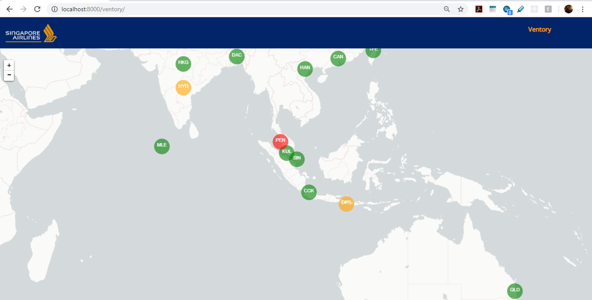
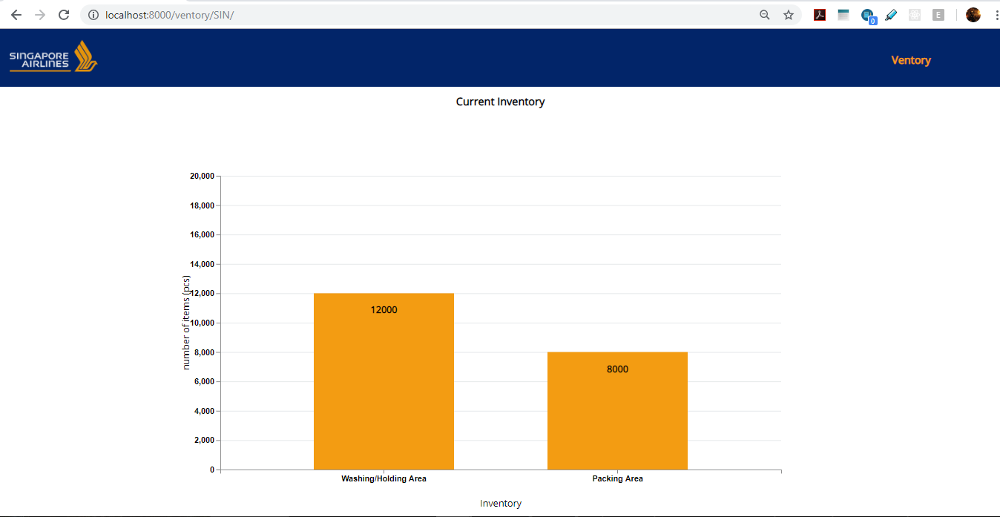
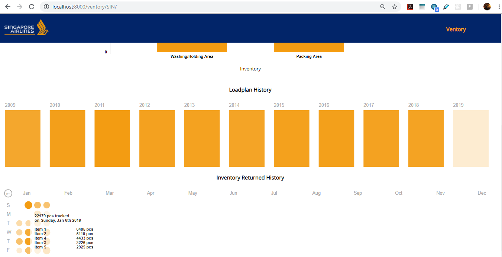
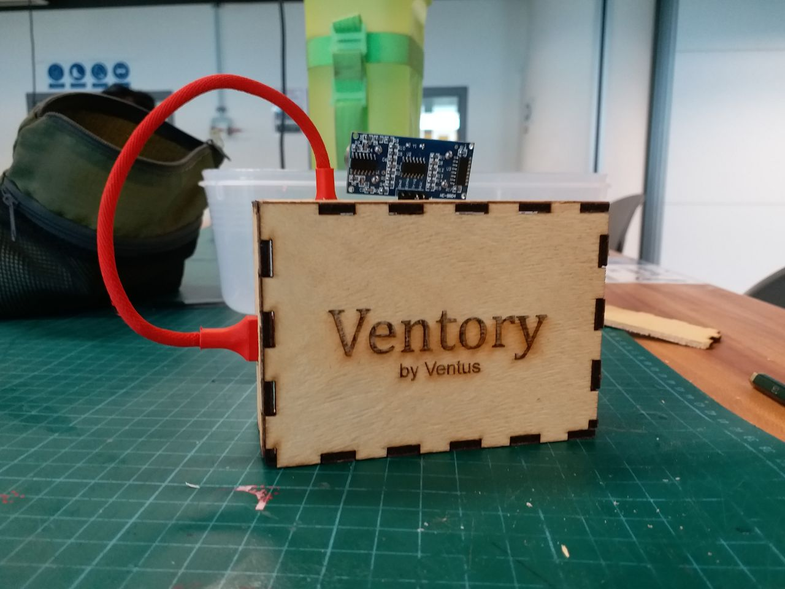

# SIA_app

  
  
  
  
  

A web dashboard to monitor the amount of inventories in SIA Stations Worldwide. Realtime inventories integration with Ventory.
[Dashboard Demo](https://www.youtube.com/watch?time_continue=43&v=bVgsyYXPHWE)

## Hardware
- Raspberry Pi
- Ultrasensor

## Sofware
- Django
- D3.js
